# E-Commerce System Use Case Diagram

## 🎯 **PlantUML Code (Copy this to http://www.plantuml.com/plantuml/uml/):**

```plantuml
@startuml E-Commerce Use Case Diagram

!theme plain

' Optimized for 500x500 square format
skinparam dpi 120
scale 1.0
skinparam packageStyle rectangle
skinparam minClassWidth 50
skinparam nodesep 10
skinparam ranksep 15

' Compact styling optimized for readability
skinparam usecase {
  BackgroundColor #F8F9FA
  BorderColor #2C3E50
  BorderThickness 1
  FontSize 8
  FontName Arial
  FontStyle normal
}

skinparam actor {
  BackgroundColor #3498DB
  BorderColor #2C3E50
  BorderThickness 1
  FontSize 9
  FontName Arial
  FontColor White
}

skinparam rectangle {
  BackgroundColor #ECF0F1
  BorderColor #34495E
  BorderThickness 1
  FontSize 8
  FontName Arial
}

skinparam package {
  BackgroundColor #FFFFFF
  BorderColor #2C3E50
  BorderThickness 2
}

' Vertical layout for square format
top to bottom direction

' Positioned actors
actor "Customer" as C
actor "Guest User" as G  
actor "Admin" as A

package "🏪 E-Commerce System" {
  
  ' Compact rectangles arranged vertically
  rectangle "🔐 Auth" #E8F4FD {
    usecase (Register) as UC1
    usecase (Login) as UC2
  }
  
  rectangle "🛍️ Products" #FFF2E8 {
    usecase (Browse) as UC4
    usecase (Search) as UC5
    usecase (Details) as UC6
  }
  
  rectangle "🛒 Cart" #E8F5E8 {
    usecase (Add) as UC8
    usecase (View) as UC9
    usecase (Update) as UC10
  }
  
  rectangle "📦 Orders" #F8E8FF {
    usecase (Place) as UC12
    usecase (History) as UC13
    usecase (Track) as UC15
  }
  
  rectangle "👤 Profile" #FFF8E8 {
    usecase (View) as UC16
    usecase (Edit) as UC17
  }
  
  rectangle "⚙️ Admin" #FFE8E8 {
    usecase (Manage\nProducts) as UC19
    usecase (Dashboard) as UC26
  }
}

' Streamlined relationships
C --> UC1
C --> UC2
C --> UC4
C --> UC5
C --> UC6
C --> UC8
C --> UC9
C --> UC10
C --> UC12
C --> UC13
C --> UC15
C --> UC16
C --> UC17

G --> UC1
G --> UC4
G --> UC5
G --> UC6

A --> UC2
A --> UC19
A --> UC26

@enduml
```

## 🚀 **How to Use:**

1. **Copy the PlantUML code above**
2. **Go to**: http://www.plantuml.com/plantuml/uml/
3. **Paste the code** in the text area
4. **Click "Submit"** to generate your diagram
5. **Download** as PNG, SVG, or PDF

```mermaid
graph LR
    Customer[� Customer]
    Guest[👤 Guest User]  
    Admin[👤 Admin]
    
    subgraph System[🏪 E-Commerce System]
        UC1((Register))
        UC2((Login))
        UC3((Logout))
        UC4((Browse Products))
        UC5((Search))
        UC6((View Details))
        UC7((Filter))
        UC8((Add to Cart))
        UC9((View Cart))
        UC10((Update Cart))
        UC11((Remove Item))
        UC12((Place Order))
        UC13((Order History))
        UC14((Order Details))
        UC15((Track Order))
        UC16((View Profile))
        UC17((Edit Profile))
        UC18((Settings))
        UC19((Manage Products))
        UC20((Add Product))
        UC21((Edit Product))
        UC22((Delete Product))
        UC23((Manage Orders))
        UC24((Update Status))
        UC25((Manage Users))
        UC26((Dashboard))
        UC27((Upload Images))
    end
    
    Customer --> UC1
    Customer --> UC2
    Customer --> UC3
    Customer --> UC4
    Customer --> UC5
    Customer --> UC6
    Customer --> UC7
    Customer --> UC8
    Customer --> UC9
    Customer --> UC10
    Customer --> UC11
    Customer --> UC12
    Customer --> UC13
    Customer --> UC14
    Customer --> UC15
    Customer --> UC16
    Customer --> UC17
    Customer --> UC18
    
    Guest --> UC1
    Guest --> UC4
    Guest --> UC5
    Guest --> UC6
    Guest --> UC7
    Guest --> UC12
    
    Admin --> UC2
    Admin --> UC3
    Admin --> UC4
    Admin --> UC5
    Admin --> UC6
    Admin --> UC19
    Admin --> UC20
    Admin --> UC21
    Admin --> UC22
    Admin --> UC23
    Admin --> UC24
    Admin --> UC25
    Admin --> UC26
    Admin --> UC27
```

## 📋 **Use Case Description:**

### **Actors:**
- **Customer**: Registered users who can access full functionality
- **Guest User**: Unregistered visitors with limited access
- **Admin**: System administrators with management privileges

### **Main Use Cases:**

#### **Authentication:**
- Register Account, Login, Logout

#### **Product Management:**
- Browse Products, Search Products, View Product Details, Filter by Category

#### **Shopping Cart:**
- Add to Cart, View Cart, Update Cart Quantity, Remove from Cart

#### **Order Processing:**
- Place Order, View Order History, View Order Details, Track Order Status

#### **Profile Management:**
- View Profile, Edit Profile, Manage Settings

#### **Admin Functions:**
- Manage Products, Add/Edit/Delete Products, Upload Images
- Manage Orders, Update Order Status, Manage Users, View Dashboard

### **Relationships:**
- **Include**: Product management includes CRUD operations
- **Extend**: Order placement can extend from cart operations
